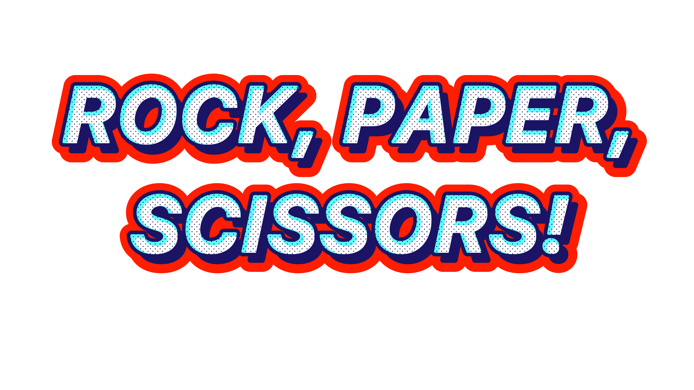

# rock-paper-scissors

Rock paper scissors game via JS. For now the game can only be played through the console. To start the game please open your console using the following shortcut:

MAC (Command + Option + J)
Windows (Control + Shift + J)

After that you can start the game by writing the following function:

game(); 

The game will prompt you to input a "pick" which in this case can be either "rock", "paper" or "scissors". The game will run for 5 rounds and at the end of the round it will output the winner of the total 5 rounds. Please note that it will result in an error if you mispell the choice but it is fine to use capital letters if you want or all lowercase, meaning it's case insensitive. 

created by Fernando Cordero
